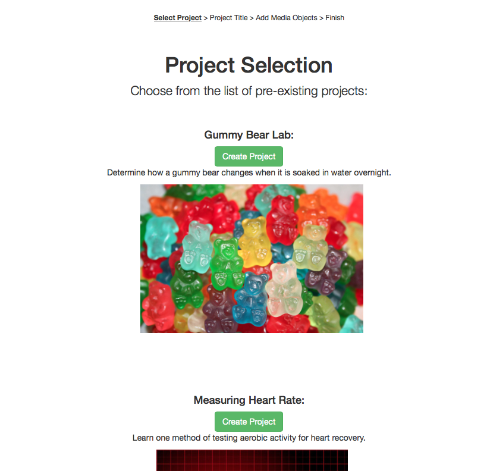
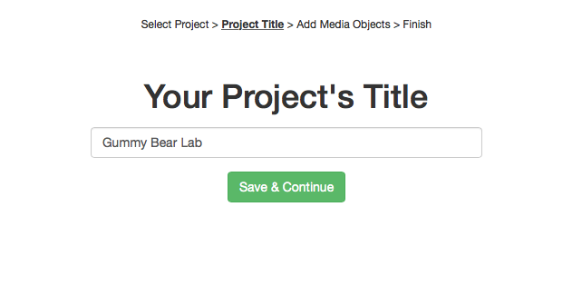
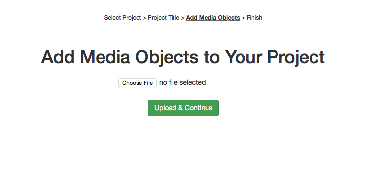
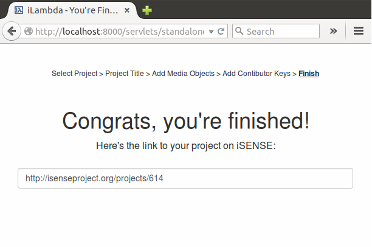

iLambda is designed to aid teachers in setting up projects on iSENSE (www.isenseproject.org)--a system for collecting, visualizing, and sharing data.

##Written By:
* Kaitlyn Carcia (kcarcia) 
* Ravy Thok (rthok)

####Screenshot of the Login Page


####Screenshot of the Project Selection Page



####Screenshot of the Project Title Page



####Screenshot of the Project Media Object Page



####Screenshot of Finish Page



##Concepts Demonstrated
* We modeled our database after a database in one of our homework assignments. We used set! and append to modify it.
* When parsing data stored in the database, we used filter and recursive processes to traverse through lists.
* We created an abstraction barrier between our database code and code to actually render the web pages. We created procedures to fetch data from our database.

##External Technology and Libraries
* We used calls in iSENSE's API to verify login credentials in iLambda.
* We also used iSENSE's racket-api to create projects.
* We also used Racket's built-in libraries: Web server and Net to create the webpage, submit through forms, and make get/post requests to the APIs.

####Kaitlyn's favorite line of code
This is my favorite line because string interpolation in Scheme is very messy, and I am so proud I was able to figure out how to actually do this. This line makes
a GET request to the iSENSE API by passing a URL with credentials that we obtain from the form.
```scheme
(define url (format "http://isenseproject.org/api/v1/users/myInfo?email=~s&password=~s" (string->symbol (login-email cred)) (string->symbol (login-password cred))))
```
####Ravy's favorite line of code
This code is for our Media Object Page. It created a browse button on the webpage that allows the user to upload a file from their computer.
```
(input ([type "file"][class "filestyle"] [name "file"]))
```

#How to Download and Run
Simply download this repo as a ZIP or clone it. You must change a path in main.rkt to get the style to work on your computer.
The path you must change is at the very bottom of the file and looks like (build-path "/Users/kaitlyncarcia/Repos/iLambda/") "htdocs")). The latest release as of 4/27 is v3.0.
