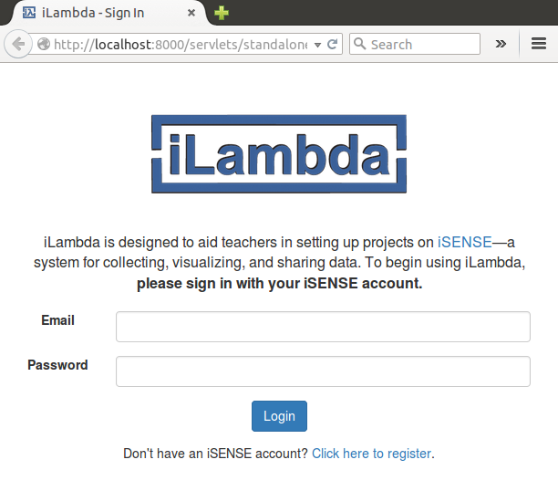
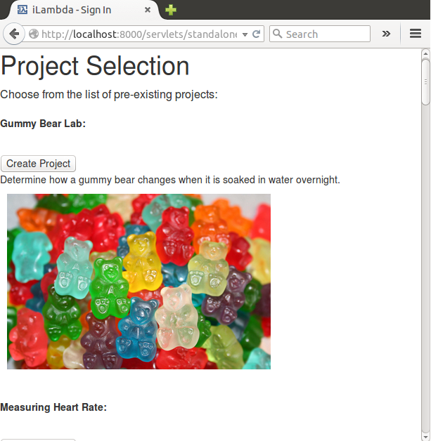

iLambda is designed to aid teachers in setting up projects on iSENSE--a system for collecting, visualizing, and sharing data.

##Written By:
* Kaitlyn Carcia (kcarcia) 
* Ravy Thok (rthok)

####Screenshot of the Login Page



####Screenshot of the Project Selection Page



####Screenshot of the Project Title Page


####Screenshot of the Project Media Object Page


####Screenshot of Finish Page


##Concepts Demonstrated
Identify the OPL concepts demonstrated in your project. Be brief. A simple list and example is sufficient. 
* **Data abstraction** is used to provide access to the elements of the RSS feed.
* The objects in the OpenGL world are represented with **recursive data structures.**
* **Symbolic language processing techniques** are used in the parser.

##External Technology and Libraries
* We used calls in iSENSE's API to verify login credentials in iLambda.
* We also used Racket's built-in libraries: Web server and Net.


####Kaitlyn's favorite line of code
Each team member should identify a favorite line of code, expression, or procedure written by them, and explain what it does. Why is it your favorite? What OPL philosophy does it embody?
Remember code looks something like this:
```scheme
(map (lambda (x) (foldr compose functions)) data)
```
####Ravy's favorite line of code
This code is for our Media Object Page. It created a browse button on the webpage that allows the user to upload a file from their computer.
```
(input ([type "file"][class "filestyle"] [name "file"]))
```

##Additional Remarks
Anything else you want to say in your report. Can rename or remove this section.

#How to Download and Run
You may want to link to your latest release for easy downloading by people (such as Mark).

Include what file to run, what to do with that file, how to interact with the app when its running, etc. 
